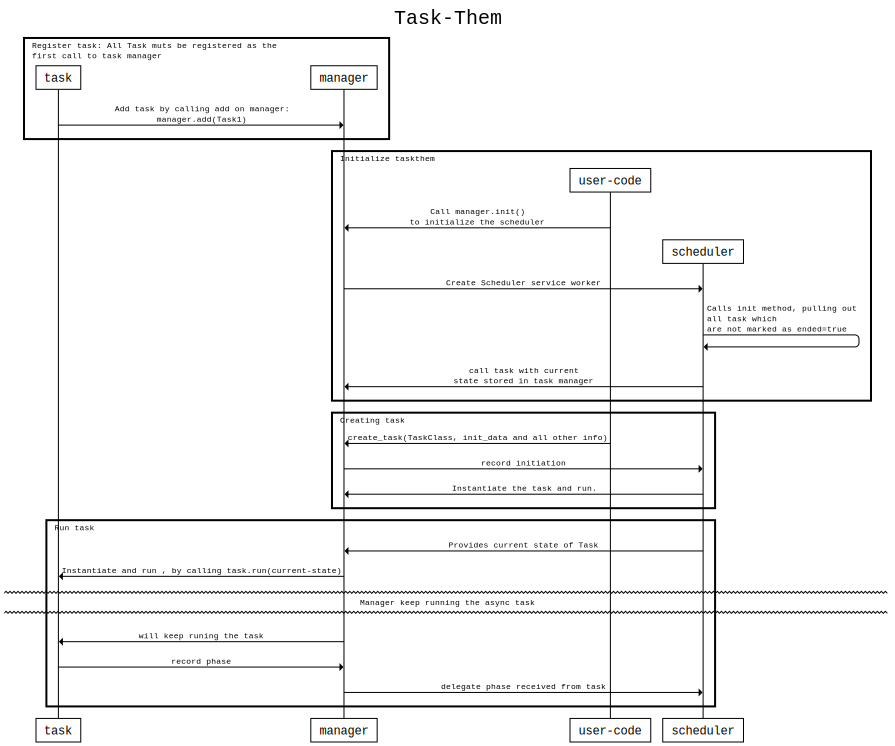

# Task-them

## Usage


## Algo
```
title Task-Them
# actors: task, manager, scheduler , idb
group Register task: "All Task muts be registered as the
first call to task manager"
  task -> manager: "Add task by calling add on manager:
manager.add(Task1)"
end

group Initialize taskthem
  user-code -> manager: "Call manager.init() 
to initialize the scheduler"
  manager -> scheduler:"Create Scheduler service worker"
  scheduler -> scheduler : "Calls init method, pulling out
all task which
are not marked as ended=true"
  scheduler -> manager :"call task with current 
state stored in task manager"
end

group Creating task
  user-code ->  manager: create_task(TaskClass, init_data and all other info)
  manager -> scheduler : record initiation
  scheduler -> manager : Instantiate the task and run.
end

group Run task
  scheduler -> manager : Provides current state of Task
  manager -> task : Instantiate and run , by calling task.run(current-state)
  divider tear with height 20: Manager keep running the async task
  manager -> task: will keep runing the task
  task -> manager : record phase
  manager -> scheduler : delegate phase received from task
end

terminators box
theme monospace
```

## Sequence Diagram


## TODO 
* one time call back on task completion
* Force overwrite "TASK_STATE:ONCE_IN_LIFE"
* cron


## Build
1. Run `npm run build`
2. Run `npm run prepublish`
3. To build index.js, run : `npx rollup -c rollup.config.js` , let it give all errors

## versions
### "version": "7.0.1"
1. Added `addLog` method in a task, to add custom logs of what has happened
2. Added `name` property in task, so during debugging its easy to deduce which class is in action.

### "version": "7.0.0"
1. Remove web workers as the task them can be added in a web-worker on gui side

### "version": "5.0.6"
1. Manager.clearTaskThem function added to clear taskthem completely

### "version": "5.0.5"
1. Bug fix : No break in task scheduler.

### "version": "5.0.3"
1. Archiving ended task, mechanism. One can mention the archiving time while initializing the task manager.
2. Added additional task behavior: ONLY_ONE_ACTIVE_IN_QUEUE, such a task can remain only one active at a time, i.e. if a task is not ended and is still in queue no new task will be created, even if called.